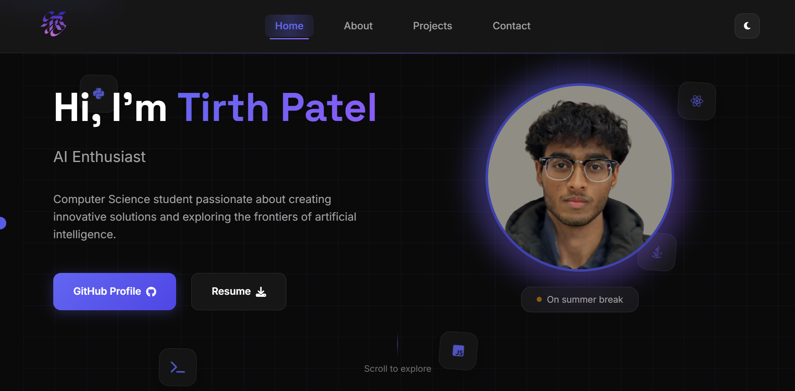

<!-- Portfolio setup -->

<div align="center">
  
</div>

<h1 align="center"> Modern Portfolio Website</h1>

<div align="center">
  <a href="https://rushii-portfolio.netlify.app" target="_blank">
  </a>
<a href="https://github.com/rushhiii/Rushi-Bashfolio" target="_blank">
  </a>
  <a href="https://github.com/rushhiii/Website-Portfolio" target="_blank">
  </a>
  <a href="https://rushii-portfolio.netlify.app/#contact" target="_blank">
  </a>

<a href="./assets/rushi_tech_resume.pdf" target="_blank">
  </a>
  <a href="https://app.netlify.com/start/deploy?repository=https://github.com/rushhiii/Website-Portfolio" target="_blank">
  </a>

</div>

<h4>The Modern Portfolio Website is tailored for developers, students, and professionals who demand a clean, responsive, and highly customizable web presence. This section focuses on HTML5, CSS3, and vanilla JavaScript—offering unique strengths for showcasing projects, skills, and professional journey with modern web development practices.</h4>

<h2> Portfolio Personalization</h2>

<div align="left">

<p>This portfolio website is a modern, responsive showcase built with clean HTML, CSS, and JavaScript. It features smooth animations, dark/light theme toggle, and a fully functional contact form integrated with Netlify. The site demonstrates modern web development practices with semantic markup, CSS Grid/Flexbox layouts, and vanilla JavaScript for enhanced user experience and performance optimization.</p>

<h3>✪ Frontend Technologies & Frameworks</h3>

🔗<b>HTML5:</b> Semantic markup with accessibility features and modern web standards.<br>
🔗<b>CSS3:</b> Grid and Flexbox layouts with custom animations and responsive design.<br>
🔗<b>JavaScript ES6+:</b> Modern features for interactive functionality and DOM manipulation.<br>
🔗<b>Font Awesome:</b> Professional icon library for enhanced visual elements.<br>

<a href="https://developer.mozilla.org/en-US/docs/Web/HTML" target="_blank">
  </a>
  <a href="https://developer.mozilla.org/en-US/docs/Web/CSS" target="_blank">
  </a>
  <a href="https://developer.mozilla.org/en-US/docs/Web/JavaScript" target="_blank">
  </a><br>


<a href="https://fontawesome.com/docs" target="_blank">
  </a>
<a href="https://fonts.google.com/" target="_blank">
  </a>
<a href="https://web.dev/responsive-web-design-basics/" target="_blank">
  </a><br>

<a href="https://web.dev/performance-budgets-101/" target="_blank">
  </a>
<a href="https://www.w3.org/WAI/WCAG21/quickref/" target="_blank">
  </a>

<h3>✫ Deployment & Hosting Platforms</h3>

🔗<b>Netlify:</b> Modern hosting with automatic CI/CD, form handling, and global CDN distribution.<br>
🔗<b>Vercel:</b> Fast deployment platform with automatic SSL and performance optimization.<br>
🔗<b>GitHub Pages:</b> Free hosting directly from GitHub repositories with custom domains.<br>
🔗<b>Firebase Hosting:</b> Google's hosting solution with fast global CDN and easy deployment.<br>

<a href="https://docs.netlify.com/" target="_blank">
  </a>
<a href="https://vercel.com/docs" target="_blank">
  </a>
<a href="https://docs.github.com/en/pages" target="_blank">
  </a><br>

<a href="https://firebase.google.com/docs/hosting" target="_blank">
  </a>

<h3>✬ Development Tools & Workflow</h3>

🔗<b>VS Code:</b> Lightweight yet powerful code editor with extensive extension ecosystem.<br>
🔗<b>Git:</b> Version control system for tracking changes and collaboration.<br>
🔗<b>Live Server:</b> Local development server with auto-reload functionality.<br>

<a href="https://code.visualstudio.com/docs" target="_blank">
  </a>
  <a href="https://git-scm.com/doc" target="_blank">
  </a>
<a href="https://marketplace.visualstudio.com/items?itemName=ritwickdey.LiveServer" target="_blank">
  </a>

<h3>✮ Portfolio Features & Components</h3>

🔗<b>Hero Section:</b> Dynamic typing effects with animated background elements and status indicators.<br>
🔗<b>About Section:</b> Bento grid layout showcasing personal journey, education, and tech stack.<br>
🔗<b>Projects Gallery:</b> Filterable showcase with category-based organization and live demos.<br>
🔗<b>Contact Form:</b> Netlify-integrated form with spam protection and email notifications.<br>

<a href="https://rushii-portfolio.netlify.app/#home" target="_blank">
  </a>

<a href="https://rushii-portfolio.netlify.app/#about" target="_blank">
  </a>

<a href="https://rushii-portfolio.netlify.app/#projects" target="_blank">
  </a>

<a href="https://rushii-portfolio.netlify.app/#contact" target="_blank">
  </a>

<h3>❂ Customization & Theming</h3>

🔗<b>CSS Variables:</b> Centralized color scheme management for easy theme customization.<br>
🔗<b>Dark/Light Mode:</b> Toggle functionality with smooth transitions and persistent preferences.<br>
🔗<b>Responsive Design:</b> Mobile-first approach ensuring perfect display on all devices.<br>
🔗<b>Animation System:</b> Custom CSS animations for enhanced user experience and visual appeal.<br>

<a href="https://github.com/rushhiii/Website-Portfolio/blob/main/css/style.css" target="_blank"> 
  </a>

<a href="https://web.dev/prefers-color-scheme/" target="_blank"> 
  </a> 
<a href="https://web.dev/responsive-web-design-basics/" target="_blank"> 
  </a> 

</div>

<div>
  <p>
    <h1></h1>
  </p>
</div>



## 📁 Project Structure

<details>
<summary>Click to expand file structure</summary>

```
Website-Portfolio/
├── 📄 index.html              # Main HTML file with semantic structure
├── 📄 thank-you.html          # Success page for form submissions  
├── 📁 css/
│   └── 🎨 style.css          # Complete styling and animations
├── 📁 js/
│   └── ⚡ script.js          # Interactive functionality and APIs
├── 📁 assets/
│   ├── 📁 ele/               # Design elements and logos
│   ├── 🖼️ profile.jpg        # Profile image
│   └── 📋 rushi_tech_resume.pdf  # Resume download
├── 📊 projects.json          # Dynamic project data
├── 🚫 .gitignore            # Git ignore rules  
├── 📜 LICENSE               # MIT License
└── 📖 README.md             # Project documentation
```

</details>

## 🚀 Getting Started

### 📋 Prerequisites
- Web browser (Chrome, Firefox, Safari, Edge)
- Code editor (VS Code recommended)
- Git (for version control)

### 🔧 Local Development

1. **📥 Clone the repository**
   ```bash
   git clone https://github.com/rushhiii/Website-Portfolio.git
   cd Website-Portfolio
   ```

2. **🌐 Open in your browser**
   - Simply open `index.html` in your web browser
   - Or use a local server for better development experience:
   ```bash
   # Using Python
   python -m http.server 8000
   
   # Using Node.js
   npx serve .
   
   # Using VS Code Live Server extension
   # Right-click on index.html → "Open with Live Server"
   ```

3. **👀 View the website**
   - Open `http://localhost:8000` in your browser

## 🚀 Deployment

### 🌐 Netlify (Recommended)

[](https://app.netlify.com/start/deploy?repository=https://github.com/rushhiii/Website-Portfolio)

**Step-by-step deployment:**

1. **🍴 Fork this repository** to your GitHub account
2. **🔗 Connect to Netlify** - Go to [Netlify](https://netlify.com) and deploy from Git
3. **📧 Configure Forms** - Forms work automatically with Netlify

### 🌍 Alternative Deployment Options
- **Vercel**: Connect GitHub repo for automatic deployment
- **GitHub Pages**: Enable in repository settings  
- **Firebase Hosting**: Use Firebase CLI for deployment

## 📧 Contact Form Configuration

The contact form is configured to work seamlessly with Netlify Forms:

```html
<form name="portfolio-contact" method="POST" data-netlify="true" action="/thank-you" netlify-honeypot="bot-field">
```

### 🛡️ Security Features
- **🍯 Spam Protection**: Includes honeypot field for bot detection
- **✅ Success Page**: Redirects to custom thank-you page  
- **📬 Email Notifications**: Configure in Netlify dashboard

## 🎨 Customization Guide

<details>
<summary>🎯 Theme Customization</summary>

### Theme Colors
Update CSS variables in `style.css`:
```css
:root {
  --primary-color: #667eea;
  --secondary-color: #764ba2;
  --accent-color: #f093fb;
  /* ... more variables */
}
```

</details>

<details>
<summary>📁 Adding New Projects</summary>

Update `projects.json` with your project data:
```json
{
  "title": "Your Amazing Project",
  "description": "Brief description of what this project does",
  "image": "./assets/project-preview.jpg",
  "tags": ["HTML", "CSS", "JavaScript"],
  "category": "web",
  "github": "https://github.com/username/repository",
  "demo": "https://your-project-demo.com"
}
```

</details>

## 🤝 Contributing

1. **🍴 Fork** the repository
2. **🌿 Create** a feature branch (`git checkout -b feature/amazing-feature`)
3. **💾 Commit** your changes (`git commit -m 'Add amazing feature'`)
4. **📤 Push** to the branch (`git push origin feature/amazing-feature`)
5. **🔄 Open** a Pull Request

## 📄 License

This project is licensed under the **MIT License** - see the [LICENSE](LICENSE) file for details.

## Contact

**Tirth Patel**  
📧 Email: rushiofficial1205@gmail.com  
💼 LinkedIn: [in/rushhiii](https://linkedin.com/in/rushhiii)  
🐙 GitHub: [@rushhiii](https://github.com/rushhiii)  
🌐 Portfolio: [rushii-portfolio.netlify.app](https://rushii-portfolio.netlify.app/)

---

⚠️ This repository is uniquely designed by <strong>@rushhiii</strong>

## 📁 Project Structure

<details>
<summary>Click to expand file structure</summary>

```
Website-Portfolio/
├── 📄 index.html              # Main HTML file
├── 📄 thank-you.html          # Success page for form submissions  
├── 📁 css/
│   └── 🎨 style.css          # All styles and animations
├── 📁 js/
│   └── ⚡ script.js          # Interactive functionality
├── 📁 assets/
│   ├── 📁 ele/               # Design elements and logos
│   ├── 🖼️ profile.jpg        # Profile image
│   └── 📋 rushi_tech_resume.pdf  # Resume download
├── 📊 projects.json          # Project data
├── 🚫 .gitignore            # Git ignore rules
├── 📜 LICENSE               # Project license
└── 📖 README.md             # Project documentation
```

</details>

## 🚀 Getting Started

### 📋 Prerequisites
- Web browser (Chrome, Firefox, Safari, Edge)
- Code editor (VS Code recommended)
- Git (for version control)

### 🔧 Local Development

1. **📥 Clone the repository**
   ```bash
   git clone https://github.com/rushhiii/Website-Portfolio.git
   cd Website-Portfolio
   ```

2. **🌐 Open in your browser**
   - Simply open `index.html` in your web browser
   - Or use a local server for better development experience:
   ```bash
   # Using Python
   python -m http.server 8000
   
   # Using Node.js
   npx serve .
   
   # Using VS Code Live Server extension
   # Right-click on index.html → "Open with Live Server"
   ```

3. **👀 View the website**
   - Open `http://localhost:8000` in your browser

## 🚀 Deployment

### 🌐 Netlify (Recommended)

[](https://app.netlify.com/start/deploy?repository=https://github.com/rushhiii/Website-Portfolio)

**Step-by-step deployment:**

1. **🍴 Fork this repository** to your GitHub account
2. **🔗 Connect to Netlify** - Go to [Netlify](https://netlify.com) and deploy from Git
3. **📧 Configure Forms** - Forms work automatically with Netlify

### 🌍 Alternative Deployment Options
- **Vercel**: Connect GitHub repo for automatic deployment
- **GitHub Pages**: Enable in repository settings  
- **Firebase Hosting**: Use Firebase CLI for deployment

## 📧 Contact Form Configuration

The contact form is configured to work seamlessly with Netlify Forms:

```html
<form name="portfolio-contact" method="POST" data-netlify="true" action="/thank-you" netlify-honeypot="bot-field">
```

### 🛡️ Security Features
- **🍯 Spam Protection**: Includes honeypot field for bot detection
- **✅ Success Page**: Redirects to custom thank-you page  
- **📬 Email Notifications**: Configure in Netlify dashboard

## 🎨 Customization Guide

<details>
<summary>🎯 Theme Customization</summary>

### Theme Colors
Update CSS variables in `style.css`:
```css
:root {
  --primary-color: #667eea;
  --secondary-color: #764ba2;
  --accent-color: #f093fb;
  /* ... more variables */
}
```

</details>

<details>
<summary>📁 Adding New Projects</summary>

Update `projects.json` with your project data:
```json
{
  "title": "Your Amazing Project",
  "description": "Brief description of what this project does",
  "image": "./assets/project-preview.jpg",
  "tags": ["HTML", "CSS", "JavaScript"],
  "category": "web",
  "github": "https://github.com/username/repository",
  "demo": "https://your-project-demo.com"
}
```

</details>

## 🤝 Contributing

1. **🍴 Fork** the repository
2. **🌿 Create** a feature branch (`git checkout -b feature/amazing-feature`)
3. **💾 Commit** your changes (`git commit -m 'Add amazing feature'`)
4. **📤 Push** to the branch (`git push origin feature/amazing-feature`)
5. **🔄 Open** a Pull Request

## 📄 License

This project is licensed under the **MIT License** - see the [LICENSE](LICENSE) file for details.

## Contact

**Tirth Patel**  
📧 Email: rushiofficial1205@gmail.com  
💼 LinkedIn: [in/rushhiii](https://linkedin.com/in/rushhiii)  
🐙 GitHub: [@rushhiii](https://github.com/rushhiii)  
🌐 Portfolio: [rushii-portfolio.netlify.app](https://rushii-portfolio.netlify.app/)

---

⚠️ This repository is uniquely designed by <strong>@rushhiii</strong>
